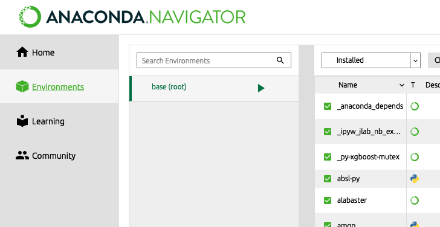
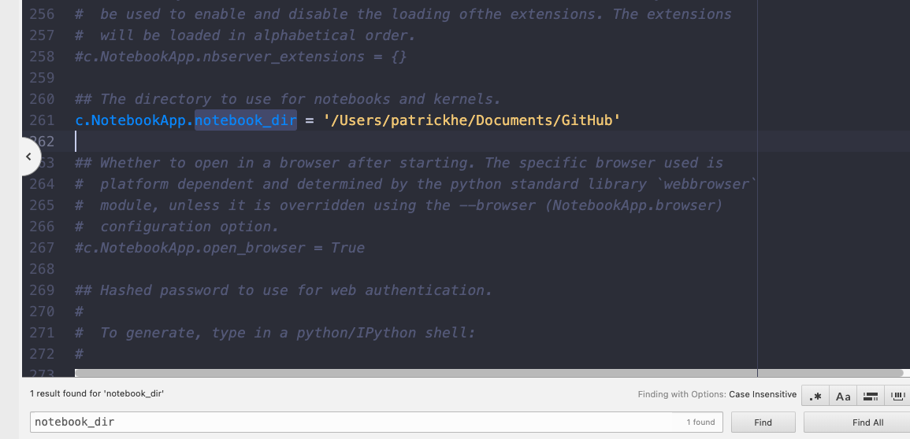

### Jupyter Notebook Default Work Directory

1. Open Anaconda Prompt 



``` python
jupyter notebook --generate-config
 
---
Writing default config to: /Users/xxx/.jupyter/jupyter_notebook_config.py
----

```

2. Follow the steps: **Finder - Manu - GO (cmd + shift + g)** then paste the file path **/Users/xxx/.jupyter/jupyter_notebook_config.py**
3. Open **jupyter_notebook_config.py** and search for 【**notebook_dir**】
4. Remove "#" and enter your work directory 



5. Open your jupyter notebook and it's done!

   